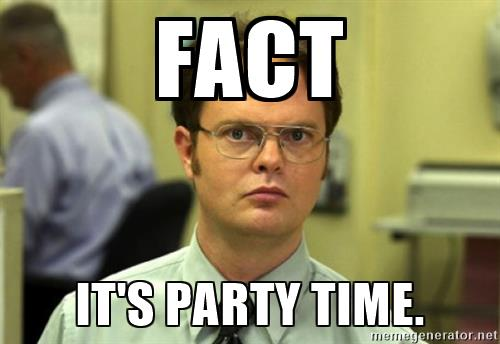

As an after-party to the big FOSDEM Free Software conference in Brussels, the oldest Hackerspace in town organises its annual free party.

# \o/ \0/ 10th edition! \o/ \0/ \o/

# Music line up
Weird music for weird people.

* CIRC8
* Jonny and the bomb
* Open impro table in the back

# Unsupported, deprecated versions
- [Bytenight v2018](https://wiki.hsbxl.be/Bytenight_2018)
- [Bytenight v2017](https://wiki.hsbxl.be/Bytenight_2017)
- [Bytenight v2016](https://wiki.hsbxl.be/Bytenight_(2016))
- [Bytenight v2015](https://wiki.hsbxl.be/Bytenight_(2015))
- [Bytenight v2014](https://wiki.hsbxl.be/Bytenight_(2014))
- [Bytenight v2013](https://wiki.hsbxl.be/Bytenight_2013)
- [Bytenight v2012](https://wiki.hsbxl.be/ByteNight_(2012))
- [Bytenight v2011](https://wiki.hsbxl.be/ByteNight_(2011))
- [Bytenight v2010](https://wiki.hsbxl.be/ByteNight_(2010))

# Organizing
Notes can be found on https://etherpad.openstack.org/p/bytenight2018

