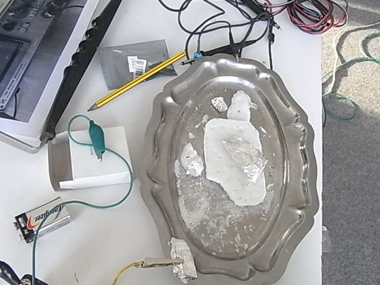

# INSTALL LAB

\- tools:

`  - magnetic stirrer hotplate`  
`  - thermometer`  
`  - funnel`  
`  - erlenmeyers`  
`  - wooden spoons`  
`  - stirring sticks`

\- ingredients:

` - CREAM OF TARTARE`  
` - DEMINERALIZED WATER`  
` - SODIUM CARBONATE`  
` - SODIUM BICARBONATE`

# Cook Piezo electric crystals

In this cooking or growing process, we experiment with different online
manuals, and follow the advise, experience and praxis of different
interviewees: Perkisas Tyché (UA Antwerpen), Selma (Bosnian high School
project). We selected Rochelle Salt as a 'test piezo electric crystal',
as we can grow it in the our DIY
lab.

## SESSION ccc - Leipzig

  - INSTRUCTIONS:

<https://sites.google.com/site/scidiy/diy-electro/piezo-rochelle-salt-crystal>

`  - no pure crystals:  due to unknown quality of cream of tartare`

## SESSION 2 S14 - Antwerp

S14 -
Antwerp

  - INSTRUCTIONS

[http://www.extremenxt.com/blog/?page\_id=77|http://www.extremenxt.com/blog/?page\_id=77](http://www.extremenxt.com/blog/?page_id=77%7Chttp://www.extremenxt.com/blog/?page_id=77)

` - no pure crystals: thermometer - not reliable`

Result test:

## SESSION 3 constantvzw

The room is fascinating, the air is thick (45%), the average room
temperature 23°, the atmosphere is relaxed, the voices are pleasant.
15th floor, World Trade center Brussels, Constant vzw Studio. Altitude:
10Om.

BATCH 3

  - INSTRUCTIONS

<http://www.extremenxt.com/blog/?page_id=77>

Rapidly, after 4 hours 2 clear crystals appear in the solution.

The best crystals get selected for using as seed crystals, to enhance
the purity and size of the crystal and get a monocrystalline Rochelle
Salt. The challenge is to make an oversaturated solution and hang the
seed crystal inside, so it will grow.
<https://www.youtube.com/embed/cNyQ_pMGxWs?autoplay=0&rel=0>

` - crystals disslove, probably due to natriumbicarbonate, which contains hydrogen `

Batch 4

  - INSTRUCTIONS

<http://www.extremenxt.com/blog/?page_id=77>

Replace sodiumbicarbonate with sodiumcarbonate and experiment with
different grow carriers.

` - crystals are drying: result unknown until now`

  - INSTRUCTIONS

<https://www.erowid.org/archive/rhodium/chemistry/rochelle.html>

After calculating the [ molecular
weight](https://www.lenntech.com/calculators/molecular/molecular-weight-calculator.htm "wikilink")
of the different ingredients we decided upon the following values: -
demineralized water (125ml) - potassium tartare (100g) - sodiumcarbonate
(23g+ 10g)

The most important factor to calculate was the molecular weight
difference between Sodiumbicarbonate and Sociumcarbonate, As in the
process of 'drying', the sodiumbircabonate, we need to know the weight
of the hydrogen which evaporates, well described in
[1](https://www.thoughtco.com/make-sodium-carbonate-from-sodium-bicarbonate-608266)

` - crystals are drying: result unknown until now`

after 6 days :

Batch 5

We keep the same recipy as the crystal form well in their hexagonal form

\- demineralized water (125ml) - potassium tartare (100g) -
sodiumcarbonate (23g+ 10g)

### SESSION 4 buratinas

Batch 6

It is quiet hot outside, we are installed in a the Brussels boatwarf,
along the Brussels Canal, the wind comes from North, North west, and it
is around 25° degrees and there is a 62% relative humidity. The lab is
installed in the boat under a solar panel where the temprature is
slightly higher. Due to shortage of certain ingredients we divide the
quantity by 100.

\- demineralized water (1,25ml) - potassium tartare (1,00g) -
sodiumcarbonate (0,33g)

After cooking, we add a little alcohol (jenever) based on a procedure of
various artists to enhance the process

Batch 7

On the Brussels canals, in the boat is around 30°, it is 32 relative
humidity, the orgonite is activated and there is only 2 mm of water in
the boat.

### SESSION 5 w-o-l-k-e

We are surrounded by a lot of different minerals: quartz, tourmaline,
pierrite, amethint; agathe.

*The atmosphère et légerment humide, il y a des cris d'enfants et à coté
de nous un carrousel.*

Batch 8

### SESSION 6 Yerba Buena Center

Batch 9

### SESSION 7 Counterculturelabs

\- testing ph, using polarizing filters

\- introducing Chirality (geometric properties of some molecules and
ions)

\- checking polarizing filters

\- cooking 3 batches in bigger quantities because of accessibility to
equipment and tools

\- shortage of cream of tartare leads to experiments on quantities,
resulting in quiet pure crystal solutions

## Measure Piezo electricity

  - report different crystals/ voltage
difference

` - when hitting the crystal,the piezo elctricity is visible on the oscilloscope, but on very low voltages`

  - using different Opamp to increase the signal

` - opamps have to low input Voltage to amplify (50mV); seemingly we amplify the interference and receive a lot of FM radio `

  - piezo amplification

<http://www.richardmudhar.com/blog/using-piezo-contact-mics-right/>

\- to solder

<https://www.zachpoff.com/resources/alex-rice-piezo-preamplifier/>
<http://interface.khm.de/index.php/lab-log/piezo-disk-preamplifier/>

\- preamp schematic by lenart

  - Visualize in xymode on oscilloscope

## Resonance Frequency

We tried to drive the piezo crystal with a signal generator at 1kHz, 10V
peak to peak - no sound. Switched to the ceramic piezo - heard a clear
beep.

We taped the round ceramic piezo to the grown crystal; powered the
ceramic piezo from the signal generator, and measured voltage from the
grown crystal with the oscilloscope. The ceramic piezo acts as a
speaker, vibrating the crystal. The crystal then acts as a microphone
turning sound waves back into electricity. We +noticed that the faint
60Hz ripple on the oscilloscope actually flattened when we powered the
ceramic piezo at 1kHz, but didn't see any actual 1kHz signal on the
oscilloscope. So we increased the frequency on the signal generator, and
we started seeing a signal on the oscilloscope - yay\! 10kHz seemed to
produce the strongest signal out of the crystal.

Next, we detached the grown crystal from the ceramic piezo, and taped it
on a small cardboard box as an acoustic resonator. Then we connected the
signal generator to the grown crystal directly (10kHz, 10V
peak-to-peak), and heard a faint high-pitched
beep.

`  - To confirm the value of the signal generator, as it could also be 10Mhz.`

<http://leapsecond.com/hpan/an200-2.pdf>

<http://pages.suddenlink.net/wa5bdu/crystal_slide_show.pdf>

<https://www.jauch.com/downloadfile/5804d138f41b5_c3e35434e616a6a82bd5/quartz_crystal_theory_2007.pdf>

<https://www.electronicdesign.com/analog/fundamentals-crystal-oscillator-design>

## Audio/ processing

  - patch axoloti

Via audio input digital processing with piezosnare patch

  - resonance frequency of the crystal

430 KHz, on very high frequency, not audible for human being to amplify
we need to be conscient about the Nyquist frequency of the devices we
are using when sampling.

## Transmitting

  - Stream on p-node.org
  - transmit on local 108FM